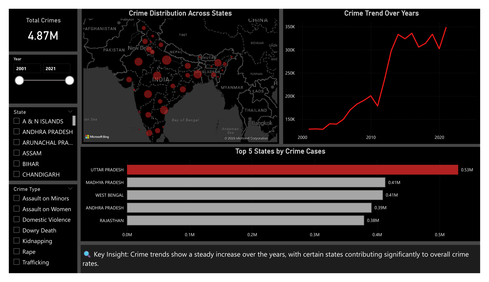
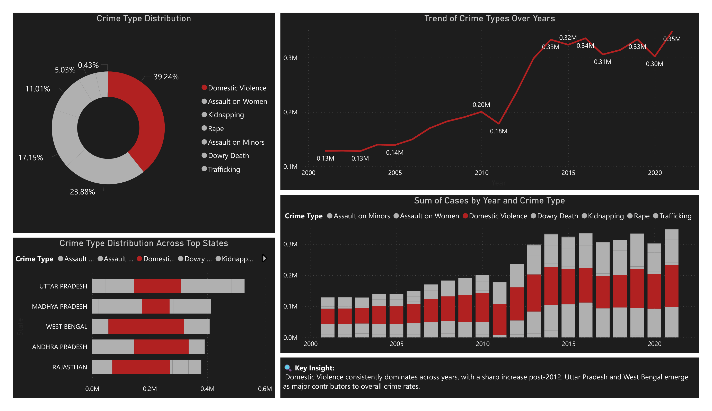
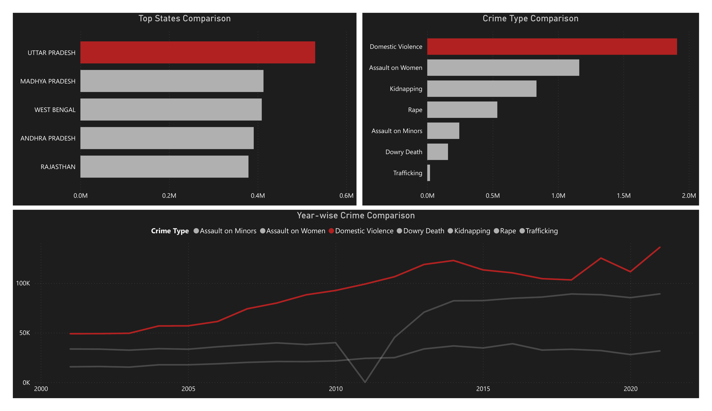
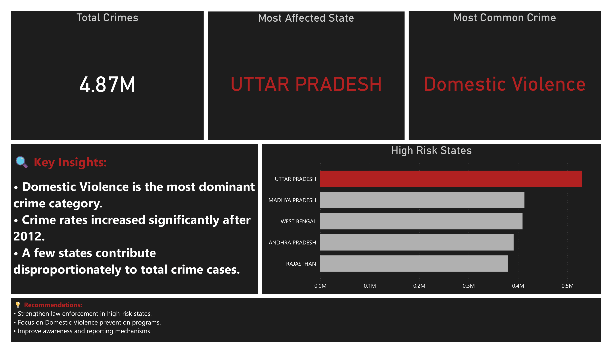

---

## 📊 Dashboard Preview

### 🔹 Overview

### 🔹 Analysis

### 🔹 Comparative Analysis

### 🔹 Insights & Recommendations

---

## 📐 Key DAX Measures
- Total Crimes
- Top State (Most Affected State)
- Top Crime Type (Most Common Crime)

> Note: All DAX measures are implemented within the Power BI (.pbix) file.

---

## 💡 Key Insights
- Crime rates have shown a steady increase over the years
- Domestic Violence is the most dominant crime category
- Certain states contribute significantly to overall crime cases

---

## 📌 Conclusion
This dashboard provides a comprehensive analysis of crime patterns and helps in identifying high-risk areas and critical issues.  
It supports data-driven decision-making through effective visualization and insights.

---

## 🚀 Future Improvements
- Integration with real-time data sources
- Advanced predictive analytics
- Deployment as a web-based dashboard

---

## 📬 Connect with Me
- LinkedIn: (https://www.linkedin.com/in/piyushs-bhajikhaye/)

---

⭐ If you found this project useful, feel free to give it a star!
